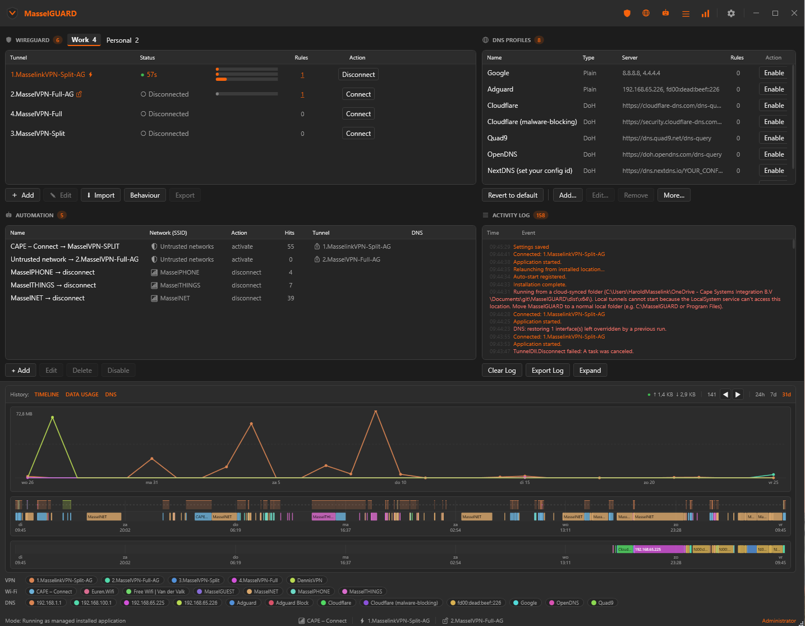
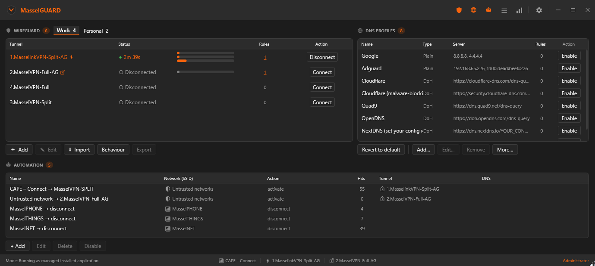
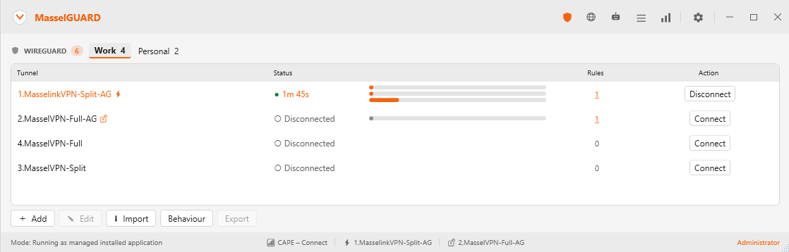
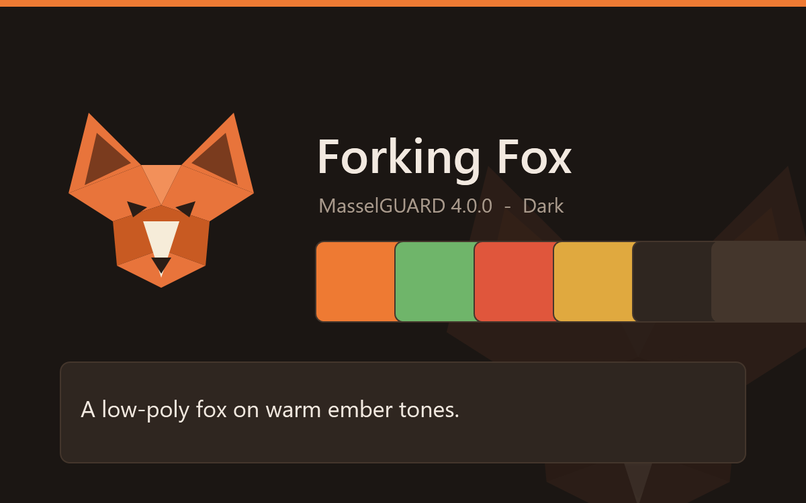

# MasselGUARD

**WireGuard + DNS control for Windows - automated by network.**

MasselGUARD is a WireGuard client that also controls your DNS, and switches **both** automatically based on the Wi-Fi you are on. Land on an unknown or open hotspot and it activates the right tunnel and encrypted DNS before anything leaks; join a trusted network and it can drop the tunnel and hand DNS back. It lives in the system tray, and works just as well as a clean manual WireGuard + DNS front-end.



- **WireGuard tunnels** - manage local (wireguard-NT) tunnels: connect / disconnect, groups, kill switch, auto-reconnect, split tunneling, data-usage caps, and import / export.
- **DNS control** - set the DNS resolver per network, with or without a tunnel active (plain or DoH), via a profiles manager, with leak protection.
- **Automation** - per-network rules that switch tunnels *and* DNS automatically (by SSID, schedule, or trusted / untrusted), plus a default action and open-network protection.

> **⚡ Native x64 *and* ARM64** - MasselGUARD ships a genuine **native ARM64** build, so on Windows-on-ARM devices (Snapdragon-based Copilot+ PCs, recent Surface) it runs at full native speed **with full standalone-tunnel support** - not under x64 emulation. Because the wireguard-NT kernel driver can't be emulated, a native ARM64 app is the *only* way to run local tunnels on ARM, and few WireGuard clients offer one. Running the x64 build on an ARM64 PC? MasselGUARD offers a **one-click switch** to the native ARM64 build at startup. ([Which download?](#which-download))

> **User manual** → [`docs/Manual.md`](docs/Manual.md)
> **CLI manual** → [`docs/CLIManual.md`](docs/CLIManual.md)
> **Technical reference** → [`docs/Reference.md`](docs/Reference.md)
> **Release notes (all versions)** → [`docs/WHATSNEW.md`](docs/WHATSNEW.md)
> **Themes** (browse, install, or make your own) → [MasselGUARD-themes](https://github.com/masselink/MasselGUARD-themes)

---

## Show as much, or as little, as you need

Every panel - **WireGuard**, **DNS**, **Automation**, **Activity log** and **History** - can be shown, hidden, or fully disabled from the title-bar buttons or Settings. The window scales from a full network dashboard down to a single tunnel list, so it fits both power users and people who just want one tunnel and no clutter.

| Focused - tunnels, DNS & automation (dark) | Minimal - just your tunnels (light) |
|---|---|
|  |  |

**Light and dark are both built in**, and every section icon and colour is themeable. Browse and install community themes from the in-app Theme Browser, or make your own - the signature **Resolving Raven** theme even ships a full custom icon set.



---

## Features

### Automation
- **Automation rules** - each rule maps a trigger to a tunnel (or "disconnect") **and/or a DNS profile**, with a **Name**, **Hits counter**, and an **Enable/Disable** switch (disabled rules grey out with a `⊘` marker and are skipped). Three trigger types:
  - **WiFi network (SSID)** - fires when you join that named network
  - **Schedule** - fires during a day/time window (checked on a timer; overnight windows supported)
  - **Trusted networks** - one policy rule: connect the tunnel on any *untrusted* WiFi, disconnect on *trusted* SSIDs (list managed in Settings → Automation)
- **Automation panel** on the main window: drag-to-reorder, hits counter, click-to-highlight matching rules in the tunnel list, plus a DNS column
- **Default action** - do nothing / disconnect / activate a fallback when no rule matches
- **Open network protection** - force a tunnel on passwordless WiFi before any rule fires
- **Defaults button** in toolbar - set/clear default action + open protection from one popup
- Rules fire exactly once per network switch (double-fire prevention)

**Rule evaluation order** (on a WiFi change - first match wins):

1. **Manual mode** → nothing happens (automation paused)
2. **Open network protection** (open WiFi + assigned tunnel)
3. **WiFi-SSID rules** (exact SSID match, top-to-bottom)
4. **Trusted-network protection** (untrusted → connect · trusted → disconnect)
5. **Default action** (fallback)

*Schedule rules* run on their own timer, outside this chain.

### DNS control
- **DNS per network, with or without a tunnel** - set which resolver each network uses on its own axis, parallel to the tunnel rules ("on any open Wi-Fi use encrypted DNS", "on the office SSID use the internal resolver", "everywhere else hand DNS back")
- **DNS profiles manager** - named IPv4/IPv6 profiles, plain or **DNS-over-HTTPS (DoH)**; **Add presets** drops in Cloudflare, Google, Quad9, AdGuard, OpenDNS and a NextDNS template, or roll your own. **Require encryption** fails closed (never falls back to plaintext)
- **DNS profiles panel** on the main window - sortable, drag-to-resize columns (Name / Type / Server / Rules / Action), per-row Enable/Disable, and a clickable Rules count
- **Manual override** - enable a profile and it sticks and overrides the tunnel's DNS; **Revert to default** hands DNS back
- **Leak protection** - closes the two Windows split-tunnel DNS-leak gaps (Settings → DNS)
- Original DNS is snapshotted before the first override and restored on exit (and recovered automatically after a crash)

**Default action vs. Trusted networks** - both catch networks that no rule matched, but default action gives **one** outcome for every network, while trusted-network protection gives **two** based on your trusted list (connect on untrusted, disconnect on trusted). Trusted protection runs *before* default action, so while it's enabled it handles every named network and the default action only applies when WiFi drops entirely. It's effectively a smarter default action - *"default = connect X"* equals a trusted rule with an empty list; *"default = disconnect"* equals one where every network is trusted.

### Auto-reconnect
- Detects unexpected tunnel drops (sleep/wake, kernel crash, network blip) and reconnects automatically
- **3 retry attempts** with 5 s / 10 s / 15 s backoff; gives up cleanly after the third failure
- Intentional disconnects (user, WiFi rule, CLI) are never retried - and a clean deactivate via the WireGuard app is recognised and respected
- Global mode in Settings → Tunnels: **Off** / **Per tunnel** / **Always** (default)
- Per-tunnel toggle in Edit Tunnel dialog; hidden when global mode is Off, greyed when Always

### WireGuard app awareness (companion tunnels)
- Connects and disconnects done in the WireGuard for Windows app are detected, logged, and recorded in history with source *WireGuard app*

### Kill switch
- **Per-tunnel kill switch** - blocks all non-tunnel outbound traffic via Windows Firewall when a tunnel is active
- **Global "Always" mode** - forces the kill switch on for every tunnel without a per-tunnel toggle
- Firewall rules (`MasselGUARD_KS_*`) are removed on clean exit; stale rules from a crash are cleaned up at startup

### Tunnel management
- Live tunnel list - Connect/Disconnect per entry, real-time uptime
- **⚡ / 🔓 badges** inline after tunnel name for default action and open protection
- **Rules column** - count of WiFi rules per tunnel; click to highlight them
- **Tunnel Groups** - colour-coded tabs, drag tunnels between groups by dropping on tab buttons, hide/show, default group, hide empty groups
- **Drag-to-reorder** tunnels and WiFi rules
- Quick Connect - connect any `.conf` from disk without importing
- Pre/post scripts at four hook points per tunnel
- **Pre-flight config validation** - key format, CIDR syntax, MTU, ports, endpoint checked before connect; per-tunnel and global skip option for unusual configs

### History & activity timeline
- **Connection history** - records every tunnel connect/disconnect with timestamp, duration, and traffic (`tunnel_history.json`)
- **WiFi history** - records SSID connect/disconnect with timestamps and open/secured status (`wifi_history.json`)
- **Activity timeline** - canvas above the footer showing tunnel sessions and WiFi rows over the last 24 h / 7 d / 31 d
- **Hover tooltip** - at any X position shows all tunnels connected and the WiFi SSID active at that time; includes duration, traffic, and 🔒/⚠ security tag
- **`< >` navigation** - cycles through tunnel sessions; tooltip shows WiFi active at each session's midpoint
- **Settings - History**: Capture and Show toggles for connections and WiFi are independent; the timeline panel auto-hides when both Show toggles are off

### Interface
- **Five panels you control** - WireGuard, DNS, Automation, Activity log and History (charts). Show, hide, or fully disable each from the **title-bar section buttons** or Settings; the layout stays consistent no matter which combination is on, and a lone panel stretches to fill
- **Dim section icons** before each panel header, matching the title-bar buttons (and fully themeable)
- **Empty state** - with everything hidden the window shows a friendly placeholder instead of a blank screen
- Activity Log: **Time** | **Event** columns, entry-count badge, Clear/Export, and **Expand** into its own resizable window
- Footer bar: mode (green when installed) | ⚡ default + 🔓 open protection | Administrator
- System tray: two-state shield icon (green filled / grey outline) with an optional DNS badge, themed menu with GDI+ icons
- **Custom WPF toast notifications** - fully themed, slides in from bottom-right, shows rule name and category; no system balloon
- **Confirm on close** - optional confirmation dialog before disconnecting active tunnels on exit

### Appearance
- **Unified dual-variant theme system** - one theme file contains both dark and light colour sets, and now dark/light *assets* too (logo, app icon, background, tray icons) - each gets its own Light and Dark picker
- **Single theme picker** in Settings → Appearance - choose a theme once; dark or light colours are applied automatically based on the current mode. Dark/Light/Follow-system applies immediately, with a save-or-discard prompt if you close Settings before saving
- **System mode pill** - Auto (follows Windows) / Light / Dark
- **System (Windows colors)** available as a theme option - uses the live Windows 11 accent palette
- **Auto colour generation** - define only dark or only light colours; the other variant is computed at load time from HSL lightness inversion, never stored
- **Theme preview** - apply the selected theme for 10 seconds before committing; auto-reverts
- **Font override** - pick any installed font; per-typeface rendering in the dropdown; size slider 8–18 pt
- **Header font** - an optional separate typeface for the title bar and section headers, distinct from the body font; one base size drives four scaled tiers used throughout the app
- **Theme Manager** *(formerly Theme Builder)* - create and edit custom dual-variant themes with live preview, per-colour transparency sliders (list hover, tray hover, highlight), Undo/Redo, and a right-click menu for Apply/Duplicate/Export/Delete
- **Community theme browser** - search, tag filters, zoomable dark/light previews, and one-click install (or reinstall to pick up updates) via **Download themes…** in Settings → Appearance
- **Theme update detection** - installed community themes are checked alongside the app-update check; a badge in Settings → Appearance and a banner in Settings → About point you to the ones with updates waiting
- **Taskbar/Alt-Tab icon** follows the active theme's app icon, same as the tray icon
- All themes - built-in, downloaded, and hand-made - live together in `%APPDATA%\MasselGUARD\themes\`
- Themes are published in the separate [MasselGUARD-themes](https://github.com/masselink/MasselGUARD-themes) repo, along with the full `theme.json` format reference for making your own
- **Custom section icons** (4.5.0) - a theme can replace the WireGuard / DNS / Automation / Charts / Activity-log glyphs with its own; the signature **Resolving Raven** theme ships a full custom set

### Settings
- **Feature-based layout** - application settings (General, Startup, Appearance, Notifications, Diagnostics, About) sit above a **Feature settings** group with one tab per feature: WireGuard, DNS, Automation, Activity log, History
- **General → Feature settings cards** - turn each feature on/off, choose what its title-bar button does (show/hide the panel, or disable the feature), and hide any button. Feature tabs dim when their feature is off
- **Fully deferred save** - most changes staged until Save; Cancel reverts everything including previews
- **WireGuard tab** - groups, auto-reconnect, kill switch, config validation, and display options in one place
- **Automation tab** - rules, default action, and open network protection in evaluation order
- **Diagnostics tab** - live readiness/connection tests and the system-diagnostics snapshot
- Start with Windows toggle (Scheduled Task, no UAC on subsequent launches)
- Notification duration picker (3 / 5 / 10 / 15 / 30 s)
- **Update check frequency** - On start / Daily / Weekly / Manual
- Twelve languages: English, Dutch, German, French, Spanish, Japanese, Italian, Portuguese (Brazil), Russian, Polish, Turkish, Chinese (Simplified) - with country flags in the picker; hold **Shift** at startup to reset to English

### Managed deployment (locked preset)
- A **`.masselguard`** file is a full settings snapshot: **import** it (wizard or General → Import) to apply-and-edit, or drop it next to the exe to **force + lock** every setting it contains - for a company rollout, a family/kids' laptop, or a kiosk
- Locked settings are forced on startup (re-asserted on every save) and shown greyed with a 🔒 and a *"managed by &lt;policy&gt;"* banner; `MasselGUARDcli.exe` honours the same file
- **General → Export as preset…** writes the file (all settings incl. automation rules; tunnel definitions never included); a policy theme not in the build is auto-downloaded from the shared-themes repo (falls back to system colours)
- **Soft lock** - suitable for managed distributions, not tamper-proof (the file is in the app folder)

---

## Requirements

| | |
|---|---|
| OS | Windows 10 or 11 - **x64 or ARM64** (separate native builds) |
| Runtime | [.NET 10 Desktop Runtime](https://dotnet.microsoft.com/download/dotnet/10.0) for your architecture |
| Elevation | Administrator (or Scheduled Task for UAC-free managed launch) |
| WireGuard engine | `tunnel.dll` + `wireguard.dll` (wireguard-NT) for your architecture, next to the exe - included in the matching release zip. No separate WireGuard install needed. |

### Which download?

Releases ship two architecture-specific builds - pick the one that matches your PC:

| Your PC | Download |
|---|---|
| Intel / AMD (the vast majority) | **`MasselGUARD-x64.zip`** |
| Windows-on-ARM - Snapdragon / Copilot+ PCs, recent Surface | **`MasselGUARD-arm64.zip`** |

On Windows-on-ARM the ARM64 build is required for **local tunnels** - the wireguard-NT kernel driver is native and can't run under x64 emulation. Not sure which you have? Settings → About and the CLI `version` command both show the running architecture; if in doubt, you're almost certainly on x64. The auto-updater always fetches the build matching your processor.

---

## Quick start

1. Extract the zip, run `MasselGUARD.exe`
2. Complete the setup wizard - or import a `.masselguard` settings file on Step 0
3. Add tunnels, create automation rules and DNS profiles, configure defaults
4. MasselGUARD handles the rest from the tray

---

## Command-line interface

MasselGUARD includes a full CLI for scripting and automation. Requires Administrator.

```
MasselGUARD version
```
```
MasselGUARD v4.5.0  |  Resolving Raven
build:   2609250000
arch:    x64
Harold Masselink  |  https://masselink.net
Update:  up to date
```

| Command | Aliases | Description |
|---|---|---|
| `list` | `--list` | All tunnels + connected/idle status |
| `status` | `--status` | Active tunnel count and names |
| `connect <name>` | - | Connect a tunnel by name |
| `connect --default` | - | Connect the configured default tunnel |
| `connect --all` | - | Connect all tunnels |
| `disconnect <name>` | - | Disconnect a tunnel by name |
| `disconnect-all` | - | Disconnect all active tunnels |
| `info <name>` | - | Detailed status for one tunnel |
| `dns status` | - | DNS-automation config + live per-interface resolvers (read-only, non-elevated) |
| `log [n]` | - | Last *n* activity log entries (default 20) |
| `tunnel-history [n]` | - | Connection history with source and traffic |
| `wifi-history [n]` | - | WiFi SSID history with duration and security |
| `import <file>` | - | Import a `.conf` or `.conf.dpapi` tunnel |
| `delete <name>` | `remove` | Remove a tunnel from config |
| `rawconnect` | - | Connect a tunnel built from inline parameters |
| `check-update` | `--check-update` | Live update check against GitHub |
| `version` | `--version`, `-v` | Version, build, author and update status |
| `help` | `--help`, `-h` | Command reference |

Flags available on any command: `--json` (machine-readable output), `--quiet` / `-q` (exit code only), `--group <name>`, `--active`.

Exit codes: `0` success · `1` error · `2` already in desired state.

---

## Build

```bat
BUILD.bat
BUILD.bat x64
BUILD.bat arm64
```

Requires the .NET 10 SDK. With no argument, `BUILD.bat` builds **both** architectures; pass `x64` or `arm64` for one. Each arch publishes natively (framework-dependent single-file, `YYMMDDHHMM` build stamp) into `dist\<arch>\` and is zipped to `dist\MasselGUARD-<arch>.zip` for release. ARM64 cross-publishes cleanly from an x64 host - the SDK produces a native ARM64 apphost. **A release needs both `MasselGUARD-x64.zip` and `MasselGUARD-arm64.zip` uploaded.**

Banner:
```
  --------------------------------------------------
  MasselGUARD  v4.5.0  |  Resolving Raven
  Harold Masselink  |  https://masselink.net
  Building arch(es): x64 arm64
  --------------------------------------------------
```

### Native DLLs (`tunnel.dll` + `wireguard.dll`)

The two wireguard-NT native DLLs are architecture-specific and live in `wireguard-deps\<arch>\`. Build/fetch them with:

```bat
tunnelbuild\tunnelbuild.bat
tunnelbuild\tunnelbuild.bat arm64
```

Run with no argument, it **prompts** for x64 / arm64 / both. `wireguard.dll` is downloaded from download.wireguard.com (which ships an arm64 build); `tunnel.dll` is compiled from wireguard-windows via Go. The **ARM64 `tunnel.dll` is a CGO cross-build** that needs an aarch64 Windows toolchain - [llvm-mingw](https://github.com/mstorsjo/llvm-mingw/releases)'s `aarch64-w64-mingw32-clang` on PATH (the script checks for it, and every produced DLL is PE-verified for the correct machine type).

Update `VERSION` / `CODENAME` in both `BUILD.bat` and `UpdateChecker.cs` when bumping the version.

---

## Security

Tunnel configs are stored as individual DPAPI-encrypted `.conf.dpapi` files in `%APPDATA%\MasselGUARD\tunnels\` (`CurrentUser` scope). `config.json` never contains key material. Existing inline-encrypted configs are migrated to files automatically on first launch. Plaintext temp file during connection is locked to `SYSTEM + Administrators + owner` from byte 0, deleted within ~200 ms.

`%APPDATA%\MasselGUARD\` is restricted to the current user only (removes inherited Administrators read access). Applied on first Settings save after installation.

---

## License

MasselGUARD's own source code is licensed under the **MIT License** - see [`LICENSE`](LICENSE).

It also bundles third-party components (the WireGuard native DLLs) that remain under their own licenses - see [`THIRD-PARTY-NOTICES.md`](THIRD-PARTY-NOTICES.md). **WireGuard** is a registered trademark of Jason A. Donenfeld; MasselGUARD is an independent project, not affiliated with or endorsed by WireGuard LLC.
