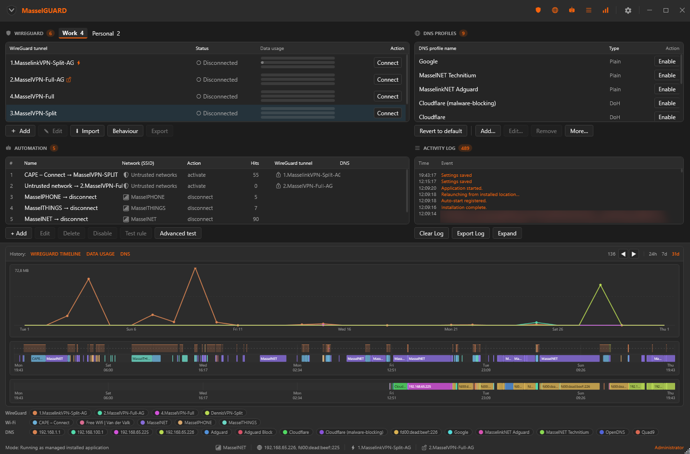
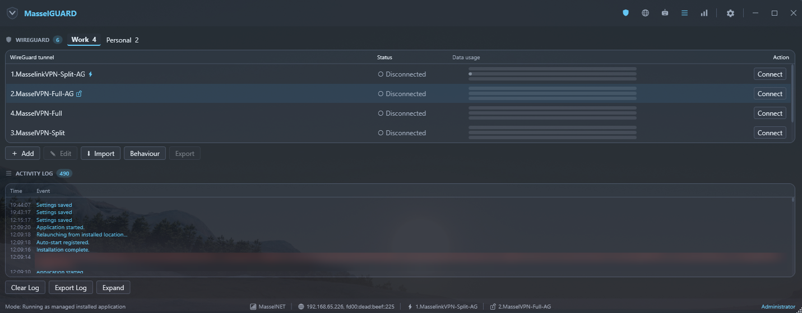
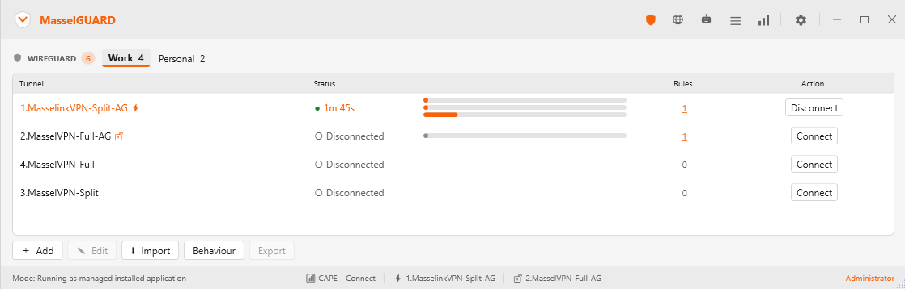
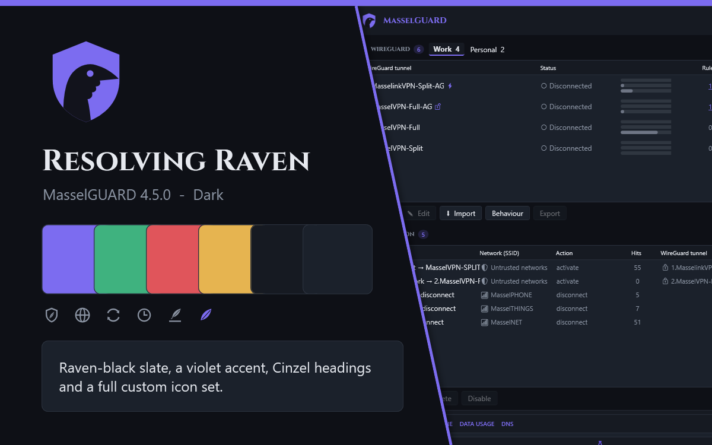

# MasselGUARD

**WireGuard + DNS control for Windows - automated by network.**

MasselGUARD is a WireGuard client that also controls your DNS, and switches **both** automatically based on the network you are on, Wi-Fi or cable. Land on an unknown or open hotspot and it activates the right tunnel and encrypted DNS before anything leaks; join a trusted network and it can drop the tunnel and hand DNS back. It lives in the system tray, and works just as well as a clean manual WireGuard + DNS front-end.



- **WireGuard tunnels** - local (wireguard-NT) tunnels with groups, kill switch, auto-reconnect, split tunneling, data-usage caps, and import / export.
- **DNS control** - a resolver per network, with or without a tunnel (plain or DNS-over-HTTPS), a profiles manager and leak protection.
- **Automation** - rules that switch tunnels *and* DNS by network (Wi-Fi name, DNS suffix, gateway MAC, subnet, adapter and more), schedule or trusted list, with a default action and open-network protection.

> **Native x64 *and* ARM64** - MasselGUARD ships a genuine native ARM64 build. On Windows-on-ARM (Snapdragon / Copilot+ PCs, recent Surface) it runs at full speed **with full local-tunnel support**; the wireguard-NT kernel driver cannot be emulated, so a native build is the only way to run local tunnels there. Running the x64 build on an ARM64 PC? MasselGUARD offers a one-click switch at startup. ([Which download?](#which-download))

| Read more | |
|---|---|
| **User manual** | [`docs/MANUAL.md`](docs/MANUAL.md) |
| **CLI manual** | [`docs/CLIManual.md`](docs/CLIManual.md) |
| **Release notes (all versions)** | [`docs/WHATSNEW.md`](docs/WHATSNEW.md) |
| **Technical reference** | [`docs/Reference.md`](docs/Reference.md) |
| **Themes** (browse, install, make your own) | [MasselGUARD-themes](https://github.com/masselink/MasselGUARD-themes) |

---

## Show as much, or as little, as you need

Every panel - **WireGuard**, **DNS**, **Automation**, **Activity log** and **History** - can be shown, hidden or fully disabled from the title-bar buttons or Settings. The window scales from a full network dashboard down to a single tunnel list.

| Tunnels and activity log, on the Glass theme | Minimal - just your tunnels (light) |
|---|---|
|  |  |

Light and dark are both built in, and colours and section icons are themeable. Install community themes from the in-app Theme Browser or make your own; the signature **Resolving Raven** theme ships a full custom icon set.



---

## Features

### Automation
- **Rules by network** - a rule matches the current network by Wi-Fi name (SSID), DNS suffix, gateway (router) MAC, subnet, connection type (Wi-Fi or wired) or the network adapter itself (name, hardware description, MAC). Combine several conditions (all must hold) and negate any of them ("is not").
- **Wi-Fi and cable** - wired connections trigger rules like Wi-Fi does. When both are connected, one **primary network** decides the tunnel (follows Windows by default, or prefer wired / Wi-Fi). DNS rules apply to every connected adapter.
- **First match wins, top-down** - the order of the rules table is the order of evaluation; the `#` column shows it and follows drag and drop.
- **Other triggers** - schedule windows (overnight supported) and a directional **trusted-networks** list (connect on untrusted, or only on trusted).
- **Default action** and **open-network protection** (force a tunnel on passwordless Wi-Fi before any rule fires).
- **Simple Wi-Fi mode** - only Wi-Fi networks and plain SSID rules are used, for people who just want the classic behaviour.
- **Test it** - **Test rule** checks one rule against the current network; **Advanced test** lets you describe any network and shows which rule fires and why, step by step. Nothing is connected or changed.
- **Fetch, don't type** - every value has a Fetch button that lists the connected networks, the PC's adapters and recently seen networks.
- **Network-change notifications** - an optional pop-up with the new network, its DNS and which automation applied.

### DNS control
- **A resolver per network, with or without a tunnel**, on its own axis next to the tunnel rules.
- **Profiles manager** - IPv4/IPv6 profiles, plain or DoH, one-click presets (Cloudflare, Google, Quad9, AdGuard, OpenDNS, NextDNS template), and **Require encryption** to fail closed.
- **DNS panel** on the main window with per-row Enable and a clickable rules count; a manual choice overrides the tunnel's DNS until you revert it.
- **Leak protection** for the two Windows split-tunnel DNS-leak gaps. Your original DNS is saved before the first override and restored on exit or after a crash.

### Tunnels
- Connect / disconnect with live uptime, **groups** as colour-coded tabs, drag to reorder, Quick Connect for any `.conf`, pre/post scripts, and pre-flight config validation.
- **Kill switch** per tunnel or global, via Windows Firewall; stale rules from a crash are cleaned up at startup.
- **Auto-reconnect** after unexpected drops (3 attempts, backed off); intentional disconnects are never retried.
- **Split tunneling** by IP range, and **data-usage caps** per day, week and month with bars or rings on each row (warn, or optionally disconnect at the cap).
- **Export and import** a tunnel as plain, password-encrypted or QR, optionally with its MasselGUARD settings.
- Tunnels connected in the WireGuard for Windows app are detected, logged and recorded in history.

### History and diagnostics
- **Activity timeline** of tunnel sessions, the primary network (Wi-Fi and wired) and DNS profiles over 24 h / 7 d / 31 d, with hover details and session navigation.
- **Activity log** with a pop-out window and optional persistence.
- **System diagnostics** - environment, connectivity, active tunnels, DNS, connected networks and each rule's current status; copy it all for support.

### Light on resources
The chart redraw rate is configurable, a settings save applies the theme once, and memory is returned to Windows while the window is hidden in the tray.

### Appearance and settings
- Dual-variant themes (light and dark in one file), Windows-colour theme, font override, a Theme Manager with live preview and a community theme browser.
- A feature-based settings layout with deferred save; twelve languages (English, Dutch, German, French, Spanish, Japanese, Italian, Portuguese (Brazil), Russian, Polish, Turkish, Chinese (Simplified)).
- A first-run wizard, start with Windows (Scheduled Task, no UAC prompt), start minimized to the tray, and update checks.

### Managed deployment
A **`.masselguard`** file is a full settings snapshot. Import it to apply and edit, or drop it next to the exe to **force and lock** the settings it contains (company rollout, family laptop, kiosk). It is a soft lock, not tamper-proof. See the manual for details.

---

## Requirements

| | |
|---|---|
| OS | Windows 10 or 11 - **x64 or ARM64** (separate native builds) |
| Runtime | [.NET 10 Desktop Runtime](https://dotnet.microsoft.com/download/dotnet/10.0) for your architecture |
| Elevation | Administrator (or the Scheduled Task for a UAC-free launch) |
| WireGuard engine | `tunnel.dll` + `wireguard.dll` (wireguard-NT) next to the exe, included in the release zip. No separate WireGuard install needed. |

### Which download?

| Your PC | Download |
|---|---|
| Intel / AMD (the vast majority) | **`MasselGUARD-x64.zip`** |
| Windows-on-ARM (Snapdragon / Copilot+ PCs, recent Surface) | **`MasselGUARD-arm64.zip`** |

On Windows-on-ARM the ARM64 build is required for local tunnels. Not sure which you have? Settings → About and `MasselGUARDcli version` show the running architecture; if in doubt, it is x64. The auto-updater always fetches the build that matches your processor. Scoop users: see the [MasselGUARD-scoop](https://github.com/masselink/MasselGUARD-scoop) bucket.

---

## Quick start

1. Extract the zip and run `MasselGUARD.exe`.
2. Complete the setup wizard, or import a `.masselguard` settings file on step 0.
3. Add tunnels, then create automation rules and DNS profiles.
4. MasselGUARD handles the rest from the tray.

---

## Command line

`MasselGUARDcli.exe` covers everything you need for scripting: `list`, `status`, `connect`, `disconnect`, `disconnect-all`, `info`, `import`, `delete`, `log`, `tunnel-history`, `wifi-history` / `network-history`, `check-update`, `version` and `help`. The read-only `dns status`, `network status` and `selftest` also run in a non-elevated terminal; everything that touches a tunnel needs Administrator. Flags: `--json`, `--quiet` / `-q`, `--group <name>`, `--active`. Exit codes: `0` success, `1` error, `2` already in the desired state.

Full reference: [`docs/CLIManual.md`](docs/CLIManual.md).

---

## Build

Requires the .NET 10 SDK.

```bat
BUILD.bat                  :: both architectures, with release zips
BUILD.bat x64              :: one architecture
BUILD.bat x64 nozip run    :: quick test build, then start it
```

Each architecture publishes natively (framework-dependent single file) into `dist\<arch>\` and is zipped to `dist\MasselGUARD-<arch>.zip`. A release needs **both** zips. The native DLLs are built or fetched with `tunnelbuild\tunnelbuild.bat`. All build options, the version-bump checklist and the architecture details are in [`CLAUDE.md`](CLAUDE.md) and [`docs/Reference.md`](docs/Reference.md).

---

## Security

Tunnel configs are stored as individual DPAPI-encrypted `.conf.dpapi` files in `%APPDATA%\MasselGUARD\tunnels\` (current-user scope); `config.json` never contains key material. The plaintext temp file used while connecting is locked to SYSTEM, Administrators and the owner from the first byte and deleted within about 200 ms. `%APPDATA%\MasselGUARD\` is restricted to the current user.

---

## License

MasselGUARD's own source code is licensed under the **MIT License** - see [`LICENSE`](LICENSE).

It also bundles third-party components (the WireGuard native DLLs) that remain under their own licenses - see [`THIRD-PARTY-NOTICES.md`](THIRD-PARTY-NOTICES.md). **WireGuard** is a registered trademark of Jason A. Donenfeld; MasselGUARD is an independent project, not affiliated with or endorsed by WireGuard LLC.
